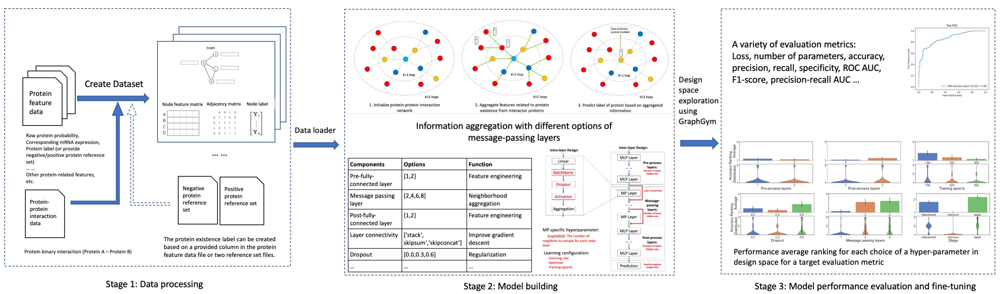

# Welcome to GrapePi: Graph neural network using Protein-protein-interaction for Enhancing Protein Identification

<p align="center">
  
</p>

# Introduction

GRAph-neural-network using Protein-protein-interaction for Enhancing Protein Identification (Grape-Pi) is a deep
learning framework for predict protein existence based on
protein feature generated from Mass spectrometry (MS) instrument/analysis software and protein-protein-interaction (PPI)
network.

The main idea is to promote proteins with medium evidence but are supported by protein-protein-interaction information
as existent. Unlike traditional network analysis, PPI information is used with strong assumptions and restricted to
specific sub-network structures (e.g. clique), Grape-Pi model is a fully data-driven model and can be much more
versatile.

--------------------------------------------------------------------------------

The contribution of Grape-Pi comes in threefold. First, we developed 
a dataloader module designed for loading MS protein data and 
protein-protein-interaction data into dataset format that can be readily
used by torch-geometry. Second, we customized the graphgym module
for the purpose of supervised learning in proteomics data. Third, we
explored the design space and discussed caveats for training such a 
model for the best performance.


# installation
**GrapePi** is built on top of the **PyTorch Geometric**, a geometric 
deep learning extension library for PyTorch. 
It consists of various methods for deep learning on graphs and
other irregular structures, also known as *[geometric deep learning](http://geometricdeeplearning.com/)*, from a 
variety of published papers.
In addition, it consists of easy-to-use mini-batch loaders for operating on many small and single giant
graphs, [multi GPU-support](https://github.com/pyg-team/pytorch_geometric/tree/master/examples/multi_gpu), [`DataPipe` support](https://github.com/pyg-team/pytorch_geometric/blob/master/examples/datapipe.py),
distributed graph learning via [Quiver](https://github.com/pyg-team/pytorch_geometric/tree/master/examples/quiver), a
large number of common benchmark datasets (based on simple interfaces to create your own),
the [GraphGym](https://pytorch-geometric.readthedocs.io/en/latest/advanced/graphgym.html) experiment manager, and
helpful transforms, both for learning on arbitrary graphs as well as on 3D meshes or point clouds.

## Create a virtual environment
It is highly recommended to use a virtual environment to install the required packages for Grape-Pi.
Please refer to https://conda.io/projects/conda/en/latest/user-guide/install/index.html for how to install a miniconda
or anaconda in your local machine.

To create a virtual environment, for example, if using conda
```angular2html
conda create -n [Name-of-the-Virtual-Environment] python=3.11
conda activate [Name-of-the-Virtual-Environment]
```
Replace `[Name-of-the-Virtual-Environment]` with your preferred name.
Currently, Grape-Pi is only available for Python >=3.11, <=3.12.


## Option 1: Install as a command line tool for prediction with a given set of hyperparameters

To install GrapePi as a command line tool, you can install it via pip. 
```
pip install grapepi
```

You don't have to download the entire project to use GrapePi as a command line tool. However, it is recommended for you to download the data/, configs/, and saved_results/ folder to get a better understanding of what the configuration file and data looks like.
```
git clone https://github.com/FDUguchunhui/GrapePi.git
cd GrapePi
```

To see options for using GrapePi as a command line tool, you can run `grapepi --help`
```
> grapepi --help
usage: grapepi [-h] --cfg CFG_FILE [--checkpoint CHECKPOINT] [--threshold THRESHOLD]
               [--num-promoted NUM_PROMOTED] [--output OUTPUT] [--override OVERRIDE]

GrapePi: Promote unconfident proteins based on prediction probability.

options:
  -h, --help            show this help message and exit
  --cfg CFG_FILE        The configuration file path.
  --checkpoint CHECKPOINT
                        The checkpoint file path.
  --threshold THRESHOLD
                        The threshold to determine the unconfident proteins based on raw
                        protein probability.
  --num-promoted NUM_PROMOTED
                        The number, N, of proteins to be promoted Top N Proteins will be
                        selected based on the prediction probability from
                        unconfidentproteins.
  --output OUTPUT       The output file path to save the promoted proteins.
  --override OVERRIDE   Override the configurations from the configuration file. This
                        argument must be a single string with the format
                        "key1=value1,key2=value2". For overriding config of list type, use
                        the format it has been additional nested by single quotation marker
                        'key1=[value1,value2]'. Example: "dataset.dir=data/yeast-LCQ
                        'dataset.node_numeric_cols=[protein_probability, mRNA]'
                        run.name=yeast_LCQ_sageconv dataset.label_col=y"
```

### Use pre-trained model to make prediction
```angular2html
grapepi --cfg saved_results/gastric_sageconv/config.yaml --checkpoint saved_results/gastric_sageconv/epoch=199-step=11800.ckpt --threshold 0.9 --num-promoted 100 --output saved_results/gastric_sageconv/evaluation
```
The above command will initialize a model which is defined in provided configuration files and  load the trained model from the checkpoint
file, make prediction on the unconfident proteins,
which are defined as proteins with raw protein probability below 0.9 and promote
100 proteins with the highest prediction protein probability. It will also 
The prediction result "promoted_protein.csv" will be
saved in the root directory of the provided data path.

You can also overwrite data path by providing
additional argument in through overwrite argument "-overwrite " key1=value2 key2=value2""  format. Be careful, the key-value pair should be separated by space and key and value should be separated by equal sign and has to be enclosed by double quotation mark. The following code can be used to use the pre-trained model to make prediction on your own data. When you just want to perform prediction task on a new data with label, you can simply set the "dataset.label_col" as any column in your data such as raw protein probability it won't have any effect for the prediction.

```angular2html
grapepi --cfg saved_results/gastric_sageconv/config.yaml --checkpoint saved_results/gastric-graphsage/epoch=199-step=11800.ckpt --threshold 0.9 --num-promoted 100 --output {YOUR_DATA_PATH} --override "dataset.dir={YOUR_DATA_PATH} dataset.label_col={YOUR_LABEL_COLUMN}, dataset.node_numeric_cols=[{YOUR_NODE_NUMERIC_COLS}]"
```
For the best performance, it is recommended to train a new model with your own data. To train a new model, you just
need to run the same command without the `--checkpoint` argument.
You can use the following command to train a new model with your own data. Here will use predefined configuration file,
which use "sageConv" as the
message-passing layer and hyperparameters that have been optimized for this task. 

Once the training is done, it will
be saved in the `results` folder by default. Go into the `results` folder, you can find a subfolder name after the
configuration file name, the ckpt file will be saved in this subfolder under "{random_seed}/ckpt" folder, where
{random_seed} is the random seed used for this training. Those path are defined in the configuration file and can be overridden similar above.


```angular2html
### Train a new model with given hyper-parameters options
grapepi --cfg saved_results/gastric_sageconv/config.yaml --threshold 0.9 --num-promoted 100 --output saved_results/gastric_sageconv/evaluation
```

It will first output the entire configuration setting and print the model structure, and start the training process.

### Data preparation
The GraphPi framework features a built-in module for easily load raw
protein and PPI data into torch.geometry.dataset
format that can be used for training model. The only things needed is to
provide a path to the dataset folder.

The dataset folder structure should look like this, with a sub-folder
named `raw` inside the `raw` sub-folder, it should have three
sub-folders: protein, interaction, and reference (optional).

The  `protein`  folder must contain exact only one **csv** file:
the first column and second column must be protein ID and raw protein probability, and other columns can contain additional protein features.

The `interaction` folder must contain exact only one **csv** file: the first
and second columns must be same type protein ID (e.g. Uniprot
accession number or gene symbol) refer to the two protein interactors,
other columns can be additional features for the interaction relationship. The ID system used should be matched with
the protein ID in the `protein` folder.

To provide ground-truth labels for the protein existence in the sample, you need to save the ground-true label information in the `protein` csv file and specify the column name of the ground-true label through `dataset.label_col` in config file.  Only labeled proteins will be used for model training, loss calculation, and then
backward propagation to update model.

### Set up model configuration
Before you can train a model based on the provided data, a configuration file is needed to for some key information:
where to find the data, how to parse the data, what features to use, model structure, what loss function to use, how to
update model weights, etc.

For example of a configuration file, please refer to `configs/protein/grapepi.yaml` in the project.

The available options in the configuration file are as follows:
```ymal
# The recommended basic settings for GNN
# Select device: 'cpu', 'cuda', 'auto'
accelerator: 'auto'
  # number of devices: eg. for 2 GPU set cfg.devices=2
devices: 1
# the number of workers for data loader. Adjust according to your machine.
num_workers: 8
# the output directory for the results. Default is "results" folder in your root directory.
out_dir: results
# the metric used for select the best model. Default is "auc". Other options: accuracy, precision, recall, f1
metric_best: auc
# the random seed for reproducibility. It is used across the project, including data split, model initialization, etc.
seed: 1234
dataset:
  name: protein # dataset type. It should be keep unchanged
  # the directory of the dataset.
  dir: data/gastric_all_data
  # whether to rebuild the dataset. If true, the dataset will be reprocessed based on provided configuration in dataset section.
  # If false, the dataset will be loaded from the processed folder. Set to true if you keep changing your dataset configuration in the testing process
  # and then change it to false during hyperparameter tuning to avoid rebuilding the same data.
  rebuild: true
  # the column name of the label in the dataset
  label_col: hard_label
    # the column names of the node features in the dataset, you should only provide the numeric columns here.
  node_numeric_cols: [protein_probability] # , mRNA_TPM
  # the column name of the edge weight in the dataset. Set to "null" if no edge weight is used.
  # Be careful! Not all layer_type support edge weight. Currently, for use edge weight, you should use "gcnconv_with_edgeweight" as gnn.layer_type.
  # sageconv doesn't support edge weight.
  interaction_weight_col : null
  # the column to use for filter interaction. Set to "null" if use all interactions.
  interaction_conf_col: null
  # the threshold for interaction confidence. Only interactions with confidence higher than this threshold will be used. It only works when interaction_conf_col is not null.
  # be careful the scale of this parameter may differ from dataset to dataset (in STRINGR range between 150-1000).
  # Please use float number even for integer values, such as 700.0 instead of 700.
  interaction_conf_thresh: 0.0
  task: node # Type of task. For Grape-Pi it is a node classification task. It should be keep unchanged
  task_type: classification # Type of task. It should be keep unchanged
  # when you have non-numeric node feature you need to encode them. Only for advanced user.
  node_encoder: false
  # when you have non-numeric edge you need to encode them. Only for advanced user.
  edge_encoder: false
    # the split ratio of the dataset train, validation, and test respectively. The sum of the split ratio should be 1.0
  split: [0.6, 0.2, 0.2]
share:
  # the input dimension of the model. -1 means the input dimension is the same as the number of node features. It should be kept it as -1
  dim_in: -1
  # the output dimension of the model. 2 is for binary classification. It should be kept it as 2 for we use Grapei-Pi for a binary classification task.
  dim_out: 2
# train section is the main sections where hyperparameters tuning happens
train:
  # the number of samples in a batch. If you use sageconv as gnn.layer_type, it means the number of nodes in a batch, you can use 64, 128, 256, ...
  # when you use gcnconv as gnn.layer_type, it should be set to 1 as it is a full batch training (each time the entire graph as input).
  batch_size: 128
  # the period of saving the model checkpoint. It should be set to 10.
  ckpt_period: 10
  # whether to clean the checkpoint folder. If true, only the last checkpoint will be saved. If false, all checkpoints will be saved.
  ckpt_clean: false
  # the sampler used for sampling the neighbor. It should be set to neighbor when you use sageconv as gnn.layer_type. and full_batch when you use gcnconv as gnn.layer_type.
  sampler: neighbor
  # Evaluated model performance for every eval_period epochs.
  eval_period: 10
  # the neighbor sizes for sampling the neighbor for each hop from the target node. It is used when you use sageconv as gnn.layer_type.
  neighbor_sizes: [20, 10, 5]
  # the epoch to resume the training. It should be set to 0 when you start the training from scratch.
  epoch_resume: 0
  # whether to use early stopping. If true, the training will stop when the performance on the validation set does not improve for early_stop_patience epochs.
  early_stop: false
  # the patience for early stopping (numer of epochs without improving). It is only used when early_stop is true.
  early_stop_patience: 50
model:
  type: gnn
  loss_fun: cross_entropy
  # the weight is calculated by num_negative_sample/num_positive_sample
gnn:
  # the number of pre-message passing layers. It should be set to 1. pre-message passing layers are just MLP
  layers_pre_mp: 1
  # the number of message passing layers. The number of mp layer how far (hops) a neighbor node can be reached from the target node.
  layers_mp: 1
  # similar to pre-message passing layers, post-message passing layers are just MLP.
  layers_post_mp: 1
  # the inner dimension of the model. it is same across all inner layers.
  dim_inner: 10
  # the type of the layer. It should be set to sageconv when you use sageconv as gnn.layer_type and gcnconv when you use gcnconv as gnn.layer_type.
  layer_type: sageconv # sageconv gcnconv
  # the type of the stage. It should be set to skipsum when you use sageconv as gnn.layer_type. Other options are stack, skipsum, skipconcat.
  # stack: no skip connection, skipsum: skip connection with sum, skipconcat: skip connection with concatenation.
  stage_type: skipsum
  # whether to use batch normalization. It should be set to false.
  batchnorm: false
  # the activation function. Currently only relu is supported.
  act: relu
  # the dropout rate. It should between 0.0 and 1.0.
  dropout: 0.0
  # whether to normalize the adjacency matrix.
  normalize_adj: false
  # the head of the model. It should be set to protein.
  head: protein
optim:
  # the optimizer used for training. Options: adam, sgd
  optimizer: adam
  # base learning rate.
  base_lr: 0.001
  # weight decay. see https://pytorch.org/docs/stable/generated/torch.optim.Adam.html for more information.
  weight_decay: 5e-4
  # the maximum number of epochs for training.
  max_epoch: 300
  # try not use schedule and check fluctuation of training curve. Options: none, step, cos
  scheduler: none
run:
  # the number of times to repeat the training. When is larger than one. The training will be repeated multiple times with different random seeds (+1 each time).
  repeat: 1
  # the name to save the out_dir. When is none, it will be saved in a subfold in out_dir folder using the configuration file name.
  # useful when you use the same config  template while overriding some parameters and want to save it under a different name.
  name: none
  # whether to mark the configuration file as with suffix "_done" after the training is done. It is useful when you have a large number of configurations to run.
  mark_done: false
```

During the programming first running, a new "processed" folder will create under the provided data folder which stores
the
converted torch_geometry.data.dataset format and additional processed files. This allows a one-time processing and the
next time data the same data is used, the processed file will be loaded directly to save time.


## Option 2: Use entire project as pipeline for hyperparameter tuning
When you have more protein-level features and new protein-protein-interaction dataset, you may need to train a new model and explore the hyperparameter space. GrapePi provides a pipeline for hyperparameter tuning. Option 2 is for advanced user since sometime you need to modify the code to fit your system architure, operating system, python version, and shell.

##  Get a copy of the project
Clone a copy of Grape-Pi from source and navigate to the root directory of the download folder. See [Cloning a repository](https://docs.github.com/en/repositories/creating-and-managing-repositories/cloning-a-repository) for more details about how to make a local copy of project.

```angular2html
git clone https://github.com/FDUguchunhui/GrapePi.git
cd GrapePi
```

## Install dependencies
We recommend the installation through Poetry using`pyproject.toml` which a new standard file for declare dependencies and build system information for Python projects. You can also use poetry to install the dependencies. Poetry is recommended to be installed in the global environment. See more t [Poetry](https://python-poetry.org/docs/)
```
cd GrapePi # navigate to the root directory of the project
poetry install --all-extras
```

Some package may not be installed correctly, you may need to install them manually, including torch, torch_geometric,
and others packages that torch and torch_geometric depends. Those packages depend on the version of python and 
pytorch, architecture of the system, and operating system. Follow the instruction below to install the required 
packages based on your environment.


Follow the installation instructions to install additional libraries to using Grape-Pi:

torch-scatter, torch-sparse, torch-cluster and torch-spline-conv (if you haven't already). Replace {CUDA} with your 
specific CUDA version or cpu.
```angular2html
pip install torch_scatter torch_sparse torch_cluster torch_spline_conv -f https://data.pyg.org/whl/torch-2.4.0+${CUDA}.html
```

If you are using pytorch=2.4.0 cpu only version, run
```angular2html
pip install torch_scatter torch_sparse torch_cluster torch_spline_conv -f https://data.pyg.org/whl/torch-2.4.0+cpu.html
```

## GrapePi training framework

The complete GrapePi training framework consists of three main components: data preparation, hyperparameter training, 
and post-training analysis. We have already touched on the data preparation in Command line tool section. Now, we focus on how to set-up batch experiment for hyperparameter tuning.

### Set up batch experiment
Batch experiment allow user to run multiple experiments with different hyper-parameters in sequential with or without
parallel. To run a batch experiment, you need to provide three configuration files. The first configuration file is the
model configuration file as described above. The second configuration file is the grid search configuration file which
specify the hyper-parameters to be searched. The third configuration file is the batch experiment configuration file
which
specify the batch experiment setting such as how many times to repeat the experiment, how many jobs to run in parallel,
etc.

### Set up grid search configuration

Grid search configuration file is a text file with each row specify a hyper-parameter to be searched. The first column
is the name of the hyper-parameter in the model configuration file, the second column is the alias of the
hyper-parameter
which will be used in the output file name, the third column is the range of the hyper-parameter to be searched.

```angular2html
# Format for each row: name in config.py; alias; range to search
# No spaces, except between these 3 fields
# Line breaks are used to union different grid search spaces
# Feel free to add '#' to add comments

gnn.dropout drop [0.0,0.3,0.6]
gnn.layers_pre_mp l_pre [1,2]
gnn.layers_mp l_mp [1,2,3]
gnn.layers_post_mp l_post [1,2]
gnn.stage_type stage ['stack','skipsum','skipconcat']
optim.max_epoch epoch [100,200,300]
train.ckpt_clean ckpt_clean [True]
```

### setup batch experiment additional configuration
Batch experiment additional configuration file is a bash file with each row specify a bash variable to be used in the
batch experiment. The first parameter `CONFIG` is the name of the model configuration file (expect to find it under
`configs/protein/` folder. The second parameter `GRID` is the name of the grid search configuration file (expect to find
it under `grids` folder. The third parameter `REPEAT` is the number of times to repeat the experiment. The fourth
parameter
`MAX_JOBS` is the number of jobs to run in parallel. The fifth parameter `SLEEP` is the time to sleep between each job.
The sixth parameter `MAIN` is the name of the main python file to execute each experiment.

```angular2html
CONFIG=${CONFIG:-protein-yeast-gcnconv}
GRID=${GRID:-protein-yeast-gcnconv}
REPEAT=${REPEAT:-3}
MAX_JOBS=${MAX_JOBS:-1}
SLEEP=${SLEEP:-0}
MAIN=${MAIN:-main}

# generate configs (aft
# er controlling computational budget)
# please remove --config_budget, if don't control computational budget
python configs_gen.py --config configs/protein/${CONFIG}.yaml \
  --grid grids/${GRID}.txt \
  --out_dir configs
#python configs_gen.py --config configs/ChemKG/${CONFIG}.yaml --config_budget configs/ChemKG/${CONFIG}.yaml --grid grids/ChemKG/${GRID}.txt --out_dir configs
# run batch of configs
# Args: config_dir, num of repeats, max jobs running, sleep time
bash parallel.sh configs/${CONFIG}_grid_${GRID} $REPEAT $MAX_JOBS $SLEEP $MAIN
# rerun missed / stopped experiments
bash parallel.sh configs/${CONFIG}_grid_${GRID} $REPEAT $MAX_JOBS $SLEEP $MAIN
# rerun missed / stopped experiments
bash parallel.sh configs/${CONFIG}_grid_${GRID} $REPEAT $MAX_JOBS $SLEEP $MAIN

# aggregate results for the batch
python agg_batch.py --dir results/${CONFIG}_grid_${GRID}
```

### run batch experiment

```angular2html
bash run_batch_yeast_gcnconv.sh
```

### Aggregate results
Run `bash run_batch_yeast_gcnconv.sh` should automatically aggregate batch experiment result into `agg` folder.
However, in case it is not generated automatically, you can manually aggregate the results by run

```angular2html 
python agg_batch.py --dir results/protein-yeast-graphsage_grid_protein-yeast-graphsage
```

The instruction above only aim to provide a start point for user to check how we did our experiment.
Please refer to https://github.com/snap-stanford/GraphGym for more details about how to config a batch experiment.


## Cite

Please cite the following papers if you use this code in your own work::
[Fast Graph Representation Learning with PyTorch Geometric

[Fast Graph Representation Learning with PyTorch Geometric
](https://arxiv.org/abs/1903.02428)

```
@inproceedings{Fey/Lenssen/2019,
  title={Fast Graph Representation Learning with {PyTorch Geometric}},
  author={Fey, Matthias and Lenssen, Jan E.},
  booktitle={ICLR Workshop on Representation Learning on Graphs and Manifolds},
  year={2019},
}
```

Common issues:

1. If you have the following problem during processing the `raw` data into `processed` data

```angular2html
utf8' codec can't decode byte 0x80 in position 3131: invalid start byte
```

This is caused by a hidden `.DS_Store` file created by the Mac OS system
Use terminal enter the `protein` folder under the `raw` folder

```angular2html
ls -a # check if there is a .DS_Store file
rm .DS_Store # remove the file
rm -r ../../processed # remove the ill-created `processed` data
```

2. Mac user may encounter the following problem

```angular2html
/Users/guchunhui/Documents/GNN-PPI/torch_geometric/typing.py:25: UserWarning: An issue occurred while importing 'pyg-lib'. Disabling its usage. Stacktrace: dlopen(/Users/guchunhui/opt/anaconda3/envs/Grape-Pi/lib/python3.10/site-packages/libpyg.so, 0x0006): Library not loaded: '/Users/runner/hostedtoolcache/Python/3.10.8/x64/lib/libpython3.10.dylib'
  Referenced from: '/Users/guchunhui/opt/anaconda3/envs/Grape-Pi/lib/python3.10/site-packages/libpyg.so'
  Reason: tried: '/Users/runner/hostedtoolcache/Python/3.10.8/x64/lib/libpython3.10.dylib' (no such file), '/usr/local/lib/libpython3.10.dylib' (no such file), '/usr/lib/libpython3.10.dylib' (no such file)
  warnings.warn(f"An issue occurred while importing 'pyg-lib'. "
/Users/guchunhui/Documents/GNN-PPI/torch_geometric/typing.py:76: UserWarning: An issue occurred while importing 'torch-sparse'. Disabling its usage. Stacktrace: dlopen(/Users/guchunhui/opt/anaconda3/envs/Grape-Pi/lib/python3.10/site-packages/libpyg.so, 0x0006): Library not loaded: '/Users/runner/hostedtoolcache/Python/3.10.8/x64/lib/libpython3.10.dylib'
  Referenced from: '/Users/guchunhui/opt/anaconda3/envs/Grape-Pi/lib/python3.10/site-packages/libpyg.so'
  Reason: tried: '/Users/runner/hostedtoolcache/Python/3.10.8/x64/lib/libpython3.10.dylib' (no such file), '/usr/local/lib/libpython3.10.dylib' (no such file), '/usr/lib/libpython3.10.dylib' (no such file)
  warnings.warn(f"An issue occurred while importing 'torch-sparse'. "
```

The solution is to run the following

```angular2html
pip uninstall pyg_lib
```

Source: https://github.com/pyg-team/pyg-lib/issues/217

3. If you see the following error during batch training, it means there is no enough system resources to performance
   such
   a batch training. Please be aware of the multiplication of `num_workers` in model configuration file and `MAX_JOBS`
   in
   parallel.sh should not exceed the total number of workers (threads) available in the system. For example, if
   `num_workers`: 2 and MAX_JOBS=${MAX_JOBS:-6} will raise error in a computer with only 8 cpu threads.

```angular2html
Sanity Checking: 0it [00:00, ?it/s]Traceback (most recent call last):
  File "/home/user/miniconda3/envs/grape-pi/lib/python3.10/multiprocessing/queues.py", line 244, in _feed
  File "/home/user/miniconda3/envs/grape-pi/lib/python3.10/multiprocessing/reduction.py", line 51, in dumps
  File "/home/user/miniconda3/envs/grape-pi/lib/python3.10/site-packages/torch/multiprocessing/reductions.py", line 369, in reduce_storage
RuntimeError: user open shared memory object </torch_2070_3445168708_503> in read-write mode: Too many open files (24)
Traceback (mosusercall last):
  File "/home/user/miniconda3/envs/grape-pi/lib/python3.10/multiprocessing/queues.py", line 244, in _feed
  File "/home/user/miniconda3/envs/grape-pi/lib/python3.10/multiprocessing/reduction.py", line 51, in dumps
  File "/home/user/miniconda3/envs/grape-pi/lib/python3.10/site-packages/torch/multiprocessing/reductions.py", line 370, in reduce_storage
  File "/home/user/miniconda3/envs/grape-pi/lib/python3.10/multiprocessing/reduction.py", line 198, in DupFd
  File "/home/user/miniconda3/envs/grape-pi/lib/python3.10/multiprocessing/resource_sharer.py", line 48, in __init__
OSError: [Errno 24] Too many open files
```

4.For Mac Apple M1/M2 user, you may encounter the following error when try Grape-Pi-SAGEConv model

```angular2html
Intel MKL FATAL ERROR: This system does not meet the minimum requirements for use of the Intel(R) Math Kernel Library.
The processor must support the Intel(R) Supplemental Streaming SIMD Extensions 3 (Intel(R) SSSE3) instructions.
The processor must support the Intel(R) Streaming SIMD Extensions 4.2 (Intel(R) SSE4.2) instructions.
The processor must support the Intel(R) Advanced Vector Extensions (Intel(R) AVX) instructions.
```

Try to install the following package.

```angular2html
conda install -y clang_osx-arm64 clangxx_osx-arm64 gfortran_osx-arm64
```

Find more details, please refer to https://github.com/rusty1s/pytorch_scatter/issues/241